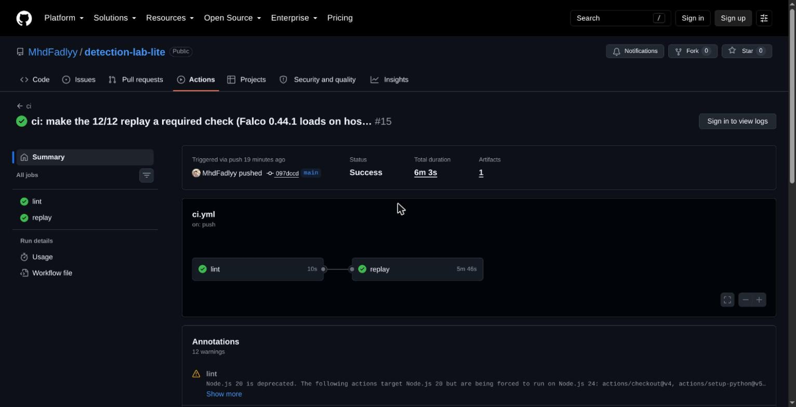
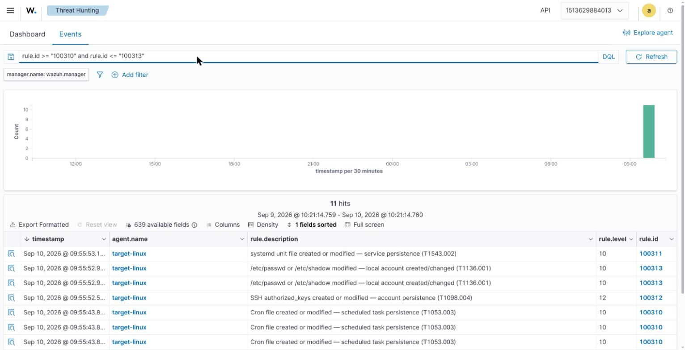

# detection-lab-lite

**A laptop-friendly, Linux-first mini-SOC where every detection is code, tested in CI.**

Most detection labs (DetectionLab, Splunk Attack Range) are heavy, Windows/AD-focused, and
VM-based. This one is **Docker only — no Vagrant, no VM images** — boots on a 16 GB laptop with
one command, and proves its detections work by *actually launching the matching attack* and
asserting the alert fires.

```
./lab bootstrap     # clone wazuh-docker + generate certs (once)
./lab up            # pull images (one at a time) + start the stack
./lab attack T1059.004
./lab verify T1059.004     # -> PASS if the expected alert fired
./lab report        # regenerate the ATT&CK coverage matrix
```

| `./lab test` replays 15 attacks and asserts every alert — 15/15, locally and in CI | Wazuh catching the persistence scenarios, ATT&CK-tagged |
|---|---|
|  |  |

📊 **[Coverage in the MITRE ATT&CK Navigator](https://mitre-attack.github.io/attack-navigator/#layerURL=https://mhdfadlyy.github.io/detection-lab-lite/navigator-layer.json)** — auto-generated from the detections + the CI test results.

## What's in the box

| | |
|---|---|
| **SIEM** | Wazuh single-node (manager + indexer + dashboard) |
| **Network IDS** | Suricata (EVE JSON → Wazuh) |
| **Runtime** | Falco (2nd detection engine, host syscalls via eBPF) |
| **Endpoint** | `target-linux` container: Wazuh agent (FIM / inotify) + Falco eBPF |
| **Honeypots** | Cowrie (SSH/Telnet), OpenCanary (`full` profile) |
| **Attacks** | Atomic Red Team + custom scenarios in `attacks/scenarios/` |
| **Detections** | Sigma (`detections/`) + hand-written Wazuh rules where Sigma falls short |
| **Dashboard** | Wazuh dashboard (Threat Hunting, MITRE ATT&CK, alert search) |
| **Docs** | mkdocs-material site + auto-generated ATT&CK Navigator layer |

## Architecture

```
attacks/scenarios/*.yml ──► target-linux (victim)
   suricata (host NIC)        │ Wazuh agent: FIM + tails the shared Falco events file
   cowrie / opencanary        ▼ eBPF syscalls (pid: host)
        │                   Falco ──► /var/log/falco/events.json  (shared volume)
        ▼ logs                │
        └────────────────────┴──►  Wazuh manager → indexer → dashboard
                                        │  ONE alert store (FIM + Falco)
                                        ▼
              harness/verify.py   engine: wazuh → indexer rule.id
                                  engine: falco → indexer data.rule
              harness/report.py   ATT&CK Navigator layer + coverage.md
```

Two detection engines, **one alert store**: **Wazuh FIM** for file changes (persistence,
credential-file writes), **Falco/eBPF** for process, file-read and network activity. Falco
writes JSON to a shared volume; the agent tails it, so Falco alerts land in the Wazuh
indexer alongside FIM. Each scenario declares which engine verifies it.

## Requirements

- Linux host (containers use the host kernel directly — no VM layer)
- Docker Engine 24+ and Compose v2
- ~8 GB RAM free, ~15 GB disk

## How detections are defined

Each detection is a **Sigma rule** in `detections/<tactic>/` — the portable, human-readable
intent. Its `dll:` block says which engine actually verifies it:

- **`engine: wazuh`** → a hand-written Wazuh FIM rule in `detections/wazuh-native/`
  (`<if_group>syscheck</if_group>`). `verify.py` queries the indexer for `rule.id`.
- **`engine: falco`** → a rule in `detections/falco/dll_rules.yaml` (or a Falco stock rule).
  Falco's JSON events are tailed into Wazuh; a rule in `detections/wazuh-native/0900-falco.xml`
  maps the Falco rule name to a `1009xx` Wazuh id. `verify.py` queries the indexer for
  `data.rule` (the Falco rule name) within `rule.groups: falco`.

Sigma-to-Wazuh auto-conversion (`harness/sigma_build.py`, `pySigma-backend-wazuh`) runs in CI
as a **portability check only** — its backend maps to stock field names and omits `if_sid`,
so the rules that actually fire are the hand-written ones above.

## Status

**Stages 1–3 done.** **15 detections across 8 ATT&CK tactics**, each with a self-contained
scenario — `./lab up && ./lab test` replays every attack and asserts the alert fires,
**15/15 green** locally and in GitHub Actions CI (a required check that boots the full stack).
Both engines (Wazuh FIM + Falco/eBPF) land in one alert store; coverage is published as an
[ATT&CK Navigator layer](https://mitre-attack.github.io/attack-navigator/#layerURL=https://mhdfadlyy.github.io/detection-lab-lite/navigator-layer.json).

Next (Stage 4): demo GIF, per-detection docs pages, `v0.1.0`, LinkedIn writeup.
This stage never really closes — detections keep getting added.

This is a long-lived project with no deadline — see [coverage](docs/coverage.md), the
[project plan](docs/plan.md), and `CONTRIBUTING.md` for the capability-stage roadmap.

## License

MIT. Offensive tooling — read `SECURITY.md` before running.
