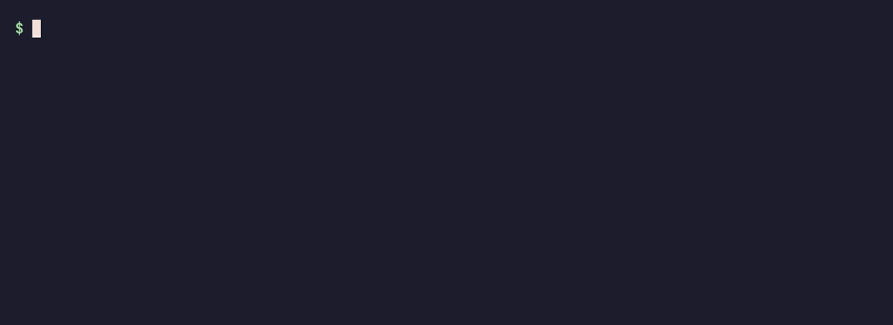
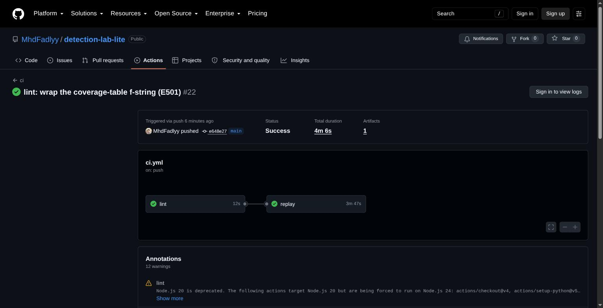
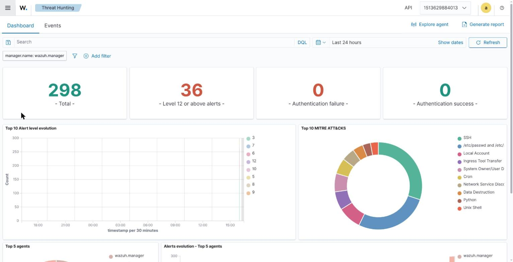
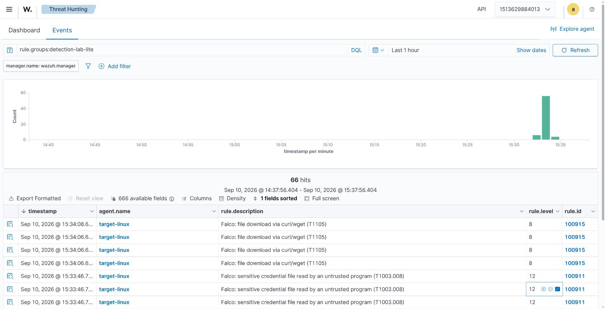
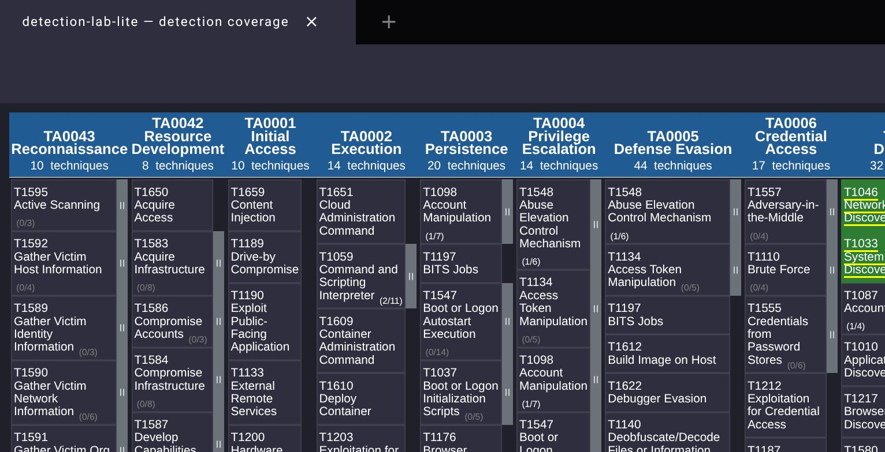

# detection-lab-lite

[](https://github.com/MhdFadlyy/detection-lab-lite/actions/workflows/ci.yml)
[](https://github.com/MhdFadlyy/detection-lab-lite/releases)
[](https://mhdfadlyy.github.io/detection-lab-lite/)

**A laptop-friendly, Linux-first mini-SOC where every detection is code, tested in CI.**

Most detection labs (DetectionLab, Splunk Attack Range) are heavy, Windows/AD-focused, and
VM-based. This one skips all that: **Docker only, no Vagrant, no VM images**. Boots on a
16 GB laptop with one command, and proves its detections work by *actually launching the
matching attack* and checking the alert fires.



```
./lab bootstrap     # clone wazuh-docker + generate certs (once)
./lab up            # pull images (one at a time) + start the stack
./lab attack T1059.004
./lab verify T1059.004     # -> PASS if the expected alert fired
./lab report        # regenerate the ATT&CK coverage matrix + Navigator layer + docs
```

| `./lab test`: replay every attack, assert every alert (22/22, local + CI) | Wazuh Threat Hunting: MITRE breakdown of what the replay tripped |
|---|---|
|  |  |

Both engines land in one alert store. Here are the FIM (`1003xx`) and Falco (`1009xx`) rules
side by side in the Wazuh event stream:



📊 **[Coverage in the MITRE ATT&CK Navigator](https://mitre-attack.github.io/attack-navigator/#layerURL=https://mhdfadlyy.github.io/detection-lab-lite/navigator-layer.json)**, auto-generated from the detections + CI results ([layer JSON](https://mhdfadlyy.github.io/detection-lab-lite/navigator-layer.json)).



## What's in the box

| | |
|---|---|
| **SIEM** | Wazuh single-node (manager + indexer + dashboard) |
| **Network IDS** | Suricata (EVE JSON → Wazuh) |
| **Runtime** | Falco (2nd detection engine, host syscalls via eBPF) |
| **Endpoint** | `target-linux` container: Wazuh agent (FIM / inotify) + Falco eBPF |
| **Honeypots** | Cowrie (SSH/Telnet), OpenCanary (FTP/HTTP + more decoys) |
| **Attacks** | Atomic Red Team + custom scenarios in `attacks/scenarios/` |
| **Detections** | Sigma (`detections/`) + hand-written Wazuh rules where Sigma falls short |
| **Dashboard** | Wazuh dashboard (Threat Hunting, MITRE ATT&CK, alert search) |
| **Docs** | mkdocs-material site + auto-generated ATT&CK Navigator layer |

## Architecture

```
attacks/scenarios/*.yml ──► target-linux (victim, shares its netns with suricata)
   suricata (target-linux's own traffic)   │ Wazuh agent: FIM + tails Falco/Suricata/Cowrie logs
   cowrie / opencanary                     ▼ eBPF syscalls (pid: host)
        │                                Falco ──► /var/log/falco/events.json  (shared volume)
        ▼ logs                             │
        └───────────────────────────────────┴──►  Wazuh manager → indexer → dashboard
                                                        │  ONE alert store
                                                        ▼
              harness/verify.py   engine: wazuh → indexer rule.id
                                  engine: falco → indexer data.rule
              harness/report.py   ATT&CK Navigator layer + coverage.md
```

**One alert store**, fed by five log sources: **Wazuh FIM** for file changes (persistence,
credential-file writes), **Falco/eBPF** for process, file-read and network activity,
**Suricata** for cleartext network signatures, **Cowrie** for honeypot login attempts, and
**OpenCanary** for interaction with its decoy FTP/HTTP services. Falco/Suricata/Cowrie/
OpenCanary all write JSON to a shared volume; the agent tails each, so every alert lands in
the same Wazuh indexer. Each scenario declares which engine verifies it.

## Requirements

- Linux host (containers use the host kernel directly, no VM layer)
- Docker Engine 24+ and Compose v2
- ~8 GB RAM free, ~15 GB disk

## How detections are defined

Each detection is a **Sigma rule** in `detections/<tactic>/`, the portable, human-readable
intent. Its `dll:` block says which engine actually verifies it:

- **`engine: wazuh`** → a hand-written Wazuh rule in `detections/wazuh-native/`, either FIM
  (`<if_group>syscheck</if_group>`, `1003xx`) or a JSON log the agent tails from a shared
  volume: Cowrie (`0500-cowrie.xml`, `1005xx`), Suricata (`0600-suricata.xml`, `1006xx`,
  chained off Wazuh's own stock Suricata rule), or OpenCanary (`0700-opencanary.xml`,
  `1007xx`). `verify.py` queries the indexer for `rule.id` either way, an optional
  `dll.log_source` tags which one for the docs.
- **`engine: falco`** → a rule in `detections/falco/dll_rules.yaml` (or a Falco stock rule).
  Falco's JSON events are tailed into Wazuh; a rule in `detections/wazuh-native/0900-falco.xml`
  maps the Falco rule name to a `1009xx` Wazuh id. `verify.py` queries the indexer for
  `data.rule` (the Falco rule name) within `rule.groups: falco`.

Sigma-to-Wazuh auto-conversion (`harness/sigma_build.py`, `pySigma-backend-wazuh`) runs in CI
as a **portability check only**. Its backend maps to stock field names and omits `if_sid`,
so the rules that actually fire are the hand-written ones above.

## Docs

Full site: **[mhdfadlyy.github.io/detection-lab-lite](https://mhdfadlyy.github.io/detection-lab-lite/)**.
See [architecture](https://mhdfadlyy.github.io/detection-lab-lite/architecture/),
a [page per detection](https://mhdfadlyy.github.io/detection-lab-lite/detections/)
(logic + attack + how it fires), the [coverage matrix](https://mhdfadlyy.github.io/detection-lab-lite/coverage/),
a [writeup](https://mhdfadlyy.github.io/detection-lab-lite/blog/building-detection-lab-lite/), and
[known limitations](https://mhdfadlyy.github.io/detection-lab-lite/limitations/) (what a
green badge here does and doesn't prove).

## Status

**[v0.2.0 released](https://github.com/MhdFadlyy/detection-lab-lite/releases/tag/v0.2.0).**
22 detections across 13 ATT&CK tactics, each with a self-contained scenario.
`./lab up && ./lab test` replays every attack and asserts the alert fires: **22/22 green**
locally and in GitHub Actions CI (a required check that boots the full stack). Three log
sources land in one alert store: Wazuh FIM, Falco/eBPF, and now Suricata + Cowrie.

Long-lived project, no deadline. `CONTRIBUTING.md` has the "add a detection in ~5 minutes"
walkthrough and the capability-stage roadmap. **Detection ideas and PRs welcome**, open a
[detection request](https://github.com/MhdFadlyy/detection-lab-lite/issues/new?template=detection-request.yml),
and a ⭐ helps if this is useful to you.

## License

MIT. Offensive tooling: read `SECURITY.md` before running.
